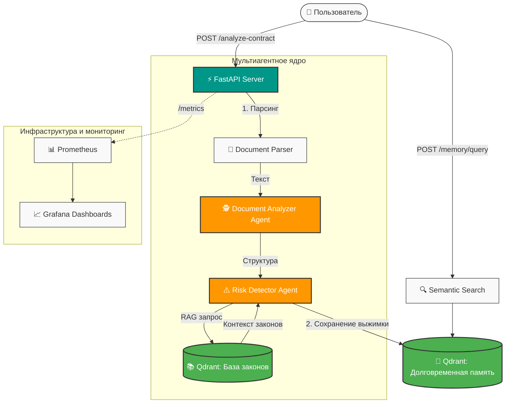

# ⚖️ AI Legal Assistant: Мультиагентная система для анализа договоров и compliance

**Enterprise-grade AI-система с долговременной памятью для автоматизации юридического аудита и анализа контрактов.**


---

## 📋 Описание проекта

Полноценная мультиагентная AI-система, которая читает юридические документы, извлекает структурированные данные, выявляет правовые риски путем сравнения с актуальной базой законов и **помнит историю своих анализов** благодаря реализованной долговременной эпизодической памяти.

### 🎯 Бизнес-ценность
- ⏱️ **Сокращение времени аудита:** Анализ сложного договора за 15 секунд вместо 2-3 часов ручной работы юриста.
- 🛡️ **Снижение правовых рисков:** Автоматическое выявление противоречий с действующим законодательством (ТК РФ, ГК РФ).
- 🧠 **Контекстная память:** Система помнит предыдущие проверки и может отвечать на ретроспективные вопросы ("Какие риски были в прошлом договоре?").
- 🔒 **On-Premise & Zero Cost:** Полная приватность данных. Локальная LLM (Qwen 2.5 через Ollama/vLLM) и векторная БД не требуют платных API и не передают конфиденциальные данные вовне.

---

## 🏗 Архитектура системы



### 🤖 Спецификация агентов (LangGraph)
1. **Document Parser:** Модуль предобработки текстов (PDF, DOCX). Очищает разметку, разлагает документ на смысловые чанки с сохранением метаданных (номера статей, пунктов).
2. **Document Analyzer Agent:** Извлекает сущности (стороны, предмет договора, суммы, сроки, обязательства) и формирует структурированный JSON.
3. **Risk Detector Agent:** Сопоставляет условия договора с нормативно-правовыми актами. Генерирует поисковые запросы в векторную коллекцию `laws`, выявляет скрытые уязвимости, штрафы и кабальные условия.

---

## 📂 Структура проекта

```text
├── app/
│   ├── agents/             # Логика агентов LangGraph
│   │   ├── analyzer.py     # Агент структурирования документов
│   │   └── risk_hunter.py  # Агент поиска рисков и compliance
│   ├── core/               # Конфигурация, настройки подключения к БД и LLM
│   ├── db/                 # Клиент Qdrant, инициализация коллекций
│   ├── services/           # Парсеры документов (PDF/DOCX) и RAG-сервис
│   └── main.py             # Точка входа FastAPI
├── database/               # Скрипты для первичного наполнения базы законов
├── monitoring/             # Конфиги Prometheus и Grafana
├── docker-compose.yml      # Оркестрация локальной инфраструктуры
├── README.md
└── requirements.txt
```

---

## 🚀 Быстрый запуск (Local Deployment)

### Пререквизиты
- Docker и Docker Compose
- Python 3.11+ (для локальной отладки)
- Скачанная локально модель Qwen 2.5 (через Ollama: `ollama run qwen2.5:14b` или `7b`)

### 1. Клонирование репозитория и настройка окружения
```bash
git clone https://github.com
cd ai-legal-assistant
cp .env.example .env
```

### 2. Запуск инфраструктуры
Запустите векторную БД Qdrant, Prometheus, Grafana и API-сервер одной командой:
```bash
docker-compose up -d --build
```

### 3. Инициализация базы законов
Скрипт загрузит базовые статьи Гражданского и Трудового кодексов РФ, разобьет их на эмбеддинги и сохранит в Qdrant:
```bash
docker exec -it ai-legal-api python database/populate_laws.py
```

---

## 🛠 Примеры использования API

После запуска документация Swagger будет доступна по адресу: `http://localhost:8000/docs`

### 1. Анализ нового договора
**Запрос:** `POST /api/v1/analyze-contract` (Multipart form-data)
- `file`: `contract_employment.pdf`

**Ответ (сокращенный):**
```json
{
  "contract_type": "Трудовой договор",
  "parties": ["ООО 'Вектор'", "Иванов И.И."],
  "analysis_status": "Success",
  "risks_found": [
    {
      "clause": "Пункт 4.2. Работодатель имеет право налагать штрафы в размере 5000 руб. за опоздание.",
      "severity": "HIGH",
      "law_contradiction": "Ст. 137 ТК РФ, Ст. 192 ТК РФ (Дисциплинарные взыскания). Штрафы как вид взыскания не предусмотрены трудовым законодательством РФ.",
      "recommendation": "Исключить пункт о штрафах. Заменить на депремирование согласно внутреннему положению об оплате труда."
    }
  ]
}
```

### 2. Запрос к долговременной памяти (Ретроспективный анализ)
**Запрос:** `POST /api/v1/memory/query`
```json
{
  "query": "В каких договорах за прошлый месяц мы встречали риски, связанные со штрафами за опоздание?"
}
```

---

## 📊 Мониторинг и MLOps

Система из коробки собирает бизнес- и технические метрики:
- **Prometheus:** Доступен на `http://localhost:9090` (собирает логи токенов, RPS, время ответа агентов).
- **Grafana:** Доступна на `http://localhost:3000` (логин/пароль по умолчанию: `admin/admin`).

**Ключевые метрики на дашборде:**
- `agent_execution_time_seconds`: Скорость работы каждого агента.
- `llm_tokens_consumed_total`: Потребление токенов (Prompt/Completion).
- `legal_risks_detected_total`: Статистика по критичности найденных рисков.
